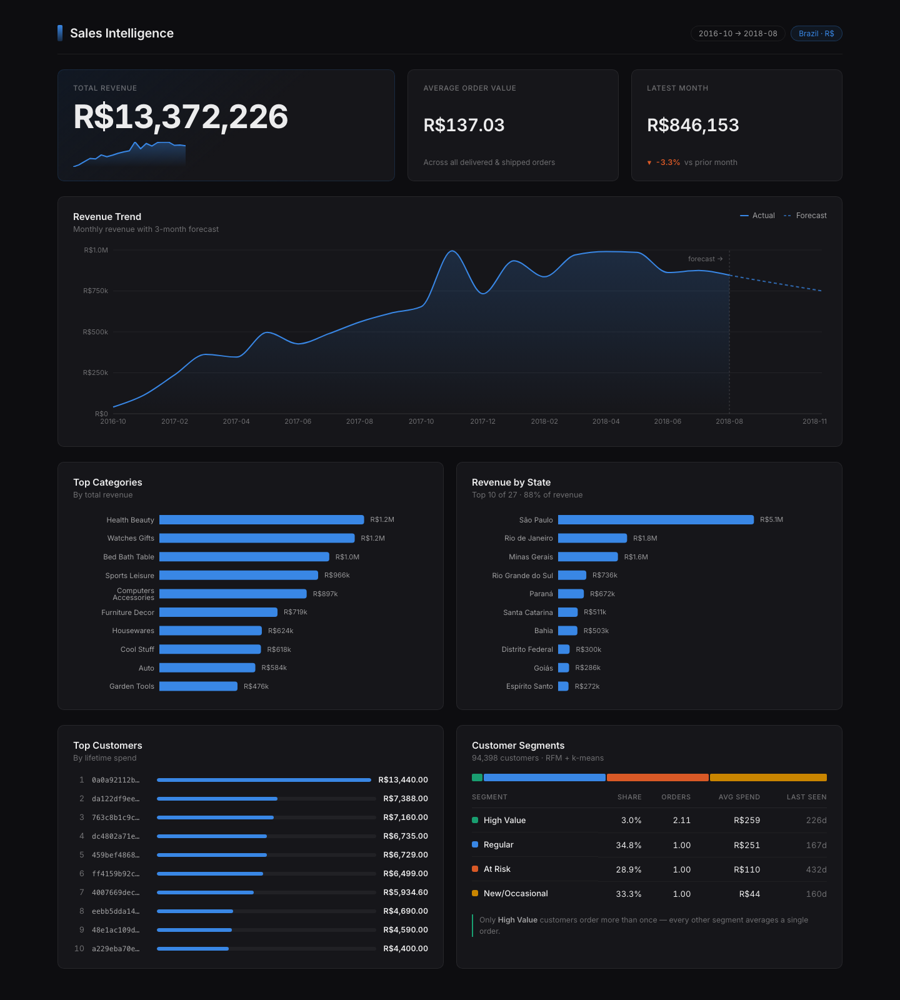

# Ecommerce Intelligence Sales System

Sales analytics over the [Olist Brazilian E-Commerce dataset](https://www.kaggle.com/datasets/olistbr/brazilian-ecommerce) (2016–2018): a pandas pipeline that ingests 9 relational CSVs, revenue forecasting and customer segmentation, a FastAPI backend, and a React dashboard.

Currency throughout is Brazilian Real (`R$`), not USD — Olist is a Brazilian marketplace.



## What it does

**Analytics** — total revenue, revenue by month, average order value, top categories, top customers, revenue by state.

**Machine learning**
- *Revenue forecasting* — a linear trend fit over a recent window. The window size was chosen by sweeping candidates against a rolling backtest, not assumed: 6 months scored **14.2% MAPE** vs 26.0% for 12 months and 31.1% for full history.
- *Customer segmentation* — RFM features + k-means over 94,398 customers, labelled from cluster centroids after fitting. The segmentation surfaces a real finding: **High Value is the only segment that orders more than once** (2.11 avg orders vs 1.00 everywhere else).

**Correctness guarantees** — joins validate key uniqueness and row counts rather than silently producing wrong numbers; canceled and unfulfilled orders are excluded from revenue; customer-level analysis keys on `customer_unique_id` (a per-person id) rather than `customer_id` (a per-order token).

## Architecture

```
ingest() → clean_all() → join_all() → run_analysis() → report / dashboard / API
                              ↓
                    forecast + segmentation
```

| Module | Responsibility |
|---|---|
| `config.py` | Paths, dataset id, table filenames — single source of truth |
| `src/ingest.py` | Downloads via `kagglehub` (skipped if `data/` is populated) and loads the raw CSVs |
| `src/stages/clean.py` | Per-table cleaning — dates, order-status filtering, missing values |
| `src/stages/join.py` | Merges into one analysis-ready frame, with join validation |
| `src/stages/analyze.py` | The six business-question functions |
| `src/stages/report.py` | Console formatting — currency, state names, category labels |
| `src/stages/visualize.py` | Matplotlib dashboard (2×2 grid) |
| `src/models/forecast.py` | Trend forecast, rolling backtest, MAE/RMSE/MAPE metrics |
| `src/models/segmentation.py` | RFM + k-means, centroid-based labelling |
| `src/pipeline.py` | `build_dataset()` and `run_pipeline()` |
| `api/` | FastAPI app — startup cache, serializers, routes |
| `frontend/` | React + TypeScript + Recharts dashboard |

## Setup

```bash
python3 -m venv venv && source venv/bin/activate
pip install -r requirements.txt
```

No Kaggle credentials are needed — Olist is a public dataset and `kagglehub` fetches it anonymously on first run (~43MB). `data/` is gitignored and populated automatically.

## Usage

**Console report**

```bash
python3 -m main
```

**Matplotlib dashboard**

```bash
python3 -m src.stages.visualize
```

**Web dashboard** — two terminals, from the project root:

```bash
# 1. API (wait for "Startup complete" — it builds the dataset once, ~5s)
python3 -m uvicorn api.main:app --port 8000

# 2. Frontend
cd frontend && npm install && npm run dev
```

Then open <http://localhost:5173>. Interactive API docs are at <http://localhost:8000/docs>.

## API

| Endpoint | Returns |
|---|---|
| `GET /api/health` | Readiness of each cached subsystem |
| `GET /api/report` | All six analytics metrics |
| `GET /api/forecast` | 3-month revenue projection |
| `GET /api/segments` | Per-segment summary (counts + mean RFM) |

`/api/segments` returns a summary by default. Pass `?include_customers=true` for the full per-customer rows — that response is ~12MB versus ~500 bytes, so it's opt-in.

The dataset is built once during app startup and cached in memory; requests are served from that cache. Forecasting and segmentation are isolated — if either fails, its endpoint returns 503 while the rest of the API keeps working, and the failure is logged with a full traceback.

## Configuration

All settings have working local defaults — deploying should never require editing source.

| Variable | Default | Purpose |
|---|---|---|
| `LOG_LEVEL` | `INFO` | Logging verbosity |
| `DATA_DIR` | `./data` | Where the CSVs are stored |
| `KAGGLE_DATASET` | `olistbr/brazilian-ecommerce` | Dataset to download |
| `CORS_ORIGINS` | *(empty)* | Comma-separated exact origins for production, e.g. `https://dashboard.example.com` |
| `CORS_ORIGIN_REGEX` | any `localhost` port | Dev fallback, used only when `CORS_ORIGINS` is empty |

## Tests

```bash
pytest -q
```

Note: API tests build the real dataset rather than mocking it, so the first run downloads the data.

## Project structure

```
config.py
main.py
api/            FastAPI backend
src/
├── ingest.py
├── pipeline.py
├── logging_config.py
├── models/     forecast.py, segmentation.py
└── stages/     clean.py, join.py, analyze.py, report.py, visualize.py
frontend/       React + TypeScript dashboard
tests/
```

## Roadmap

Built: analytics pipeline, charts, forecasting + segmentation, REST API, web dashboard.

Next: multi-dataset support (CSV upload + schema mapping), LLM report narration, retrieval over historical reports.

## Data & license

Dataset: ["Brazilian E-Commerce Public Dataset by Olist"](https://www.kaggle.com/datasets/olistbr/brazilian-ecommerce) on Kaggle. See the Kaggle page for license terms.

## Development

```bash
ruff check .              # lint
ruff format .             # format
mypy .                    # type check
pytest -q                 # all tests
pytest -q -m "not integration"   # unit tests only (~2s, no data needed)
```

Tests marked `integration` build the real dataset, so they're slower and need network on first run. CI runs the unit subset plus lint, format, types, and a frontend typecheck/build.
