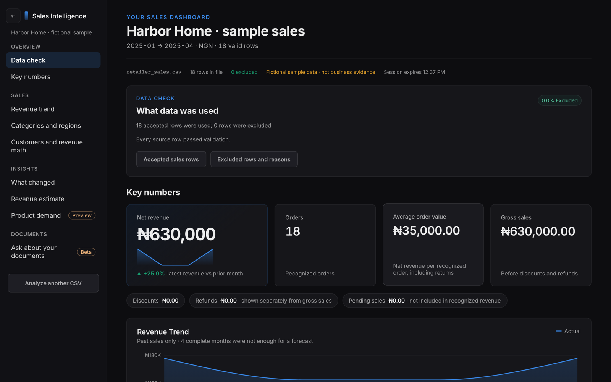
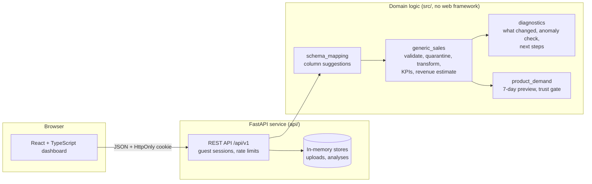
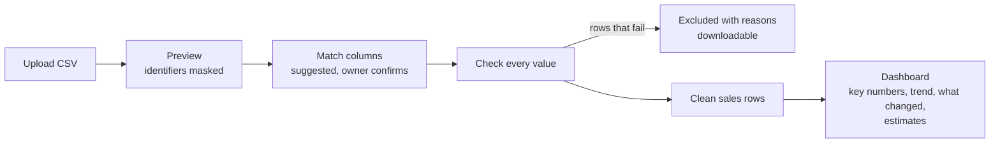

# Ecommerce Intelligence Sales System

Sales analytics for small online shops. It checks an order export before calculating anything,
then shows the key numbers and what changed from one month to the next.

[](https://github.com/tonysoftwarengineer/ecommerce-intelligence-sales-system/actions/workflows/ci.yml)




## What it does

A shop owner uploads an order export (CSV). The app:

- **Checks the data first.** It suggests which column is which, the owner confirms, and every row
  is validated. Rows that fail are excluded with a reason and can be downloaded and fixed. Nothing
  is silently repaired.
- **Shows what happened.** Net revenue, orders, average order value, the revenue trend, categories
  and regions, and what changed between the last two complete months, split into its measurable
  parts (fewer orders, or a different average order value).
- **Plans carefully.** Revenue estimates are tested against past months and labelled by how far to
  trust them. Seven-day product-demand estimates appear only when they beat a zero-demand benchmark
  in backtests; otherwise the app says why there is no estimate.

No file to hand? **Try a sample retailer** runs a clearly fictional shop, Harbor Home, through the
same steps.

## How it earns trust

| Principle | How it is enforced |
|---|---|
| Python calculates every figure | Every number comes from tested Python code. The planned AI feature will only put those numbers into words ([ADR-018](docs/architecture/ADR-018-refocus-on-explaining-sales.md)). |
| Fail closed, never guess | Unknown order statuses are quarantined until the owner classifies them, and invalid rows are never silently repaired. Currencies are reported separately and never added together. |
| Honest evaluation | Tuning uses development data only; locked test sets run once. A failed result is published, not hidden (see [Evidence](#evidence)). |
| Visitors are isolated | An HttpOnly guest cookie scopes every upload and analysis; any other browser gets "not found". |
| Decisions are written down | 18 [Architecture Decision Records](docs/architecture) explain the trade-offs. |
| Every push is tested | CI runs lint, formatting, type checks, backend tests, the frontend build, Playwright browser journeys, and a production Docker image smoke test. |

## Architecture


```mermaid
flowchart LR
    subgraph Browser
        UI["React + TypeScript dashboard"]
    end
    subgraph Service["FastAPI service (api/)"]
        API["REST API /api/v1<br/>guest sessions, rate limits"]
        Stores[("In-memory stores<br/>uploads, analyses")]
    end
    subgraph Domain["Domain logic (src/, no web framework)"]
        Map["schema_mapping<br/>column suggestions"]
        Sales["generic_sales<br/>validate, quarantine, transform,<br/>KPIs, revenue estimate"]
        Diag["diagnostics<br/>what changed, anomaly check,<br/>next steps"]
        Demand["product_demand<br/>7-day preview, trust gate"]
    end
    UI -->|"JSON + HttpOnly cookie"| API
    API --> Stores
    API --> Map --> Sales --> Diag
    Sales --> Demand
```

**From CSV to dashboard**


```mermaid
flowchart LR
    A["Upload CSV"] --> B["Preview<br/>identifiers masked"]
    B --> C["Match columns<br/>suggested, owner confirms"]
    C --> D["Check every value"]
    D -->|"rows that fail"| Q["Excluded with reasons<br/>downloadable"]
    D --> E["Clean sales rows"]
    E --> F["Dashboard<br/>key numbers, trend, what changed,<br/>estimates"]
```

## Evidence

| What was tested | Result | Details |
|---|---|---|
| Product-demand estimates, locked holdout (48 products, 624 weekly forecasts) | Delayed-start, dense, and intermittent demand passed. Sparse demand **failed** (no better than predicting zero), so estimates stay a labelled preview. | [report](docs/PRODUCT_DEMAND_LOCKED_EVALUATION.md) |
| CSV trust matrix | 15 end-to-end scenarios: revenue modes, discounts, order statuses, refunds, duplicates, date formats, and currencies | [tests](tests/test_csv_trust_matrix.py) |

## Tech stack

| Layer | Tools |
|---|---|
| Backend | Python 3.12, FastAPI, pandas |
| Frontend | React 19, TypeScript, Vite, Recharts |
| Quality | pytest, Playwright, Ruff, mypy, oxlint, GitHub Actions |
| Packaging | Docker (non-root, health check); every Python package pinned in `constraints.txt` |

## Run it locally

Requires Python 3.12 and Node 20.

```bash
python3.12 -m venv .venv && source .venv/bin/activate
pip install -r requirements-dev.txt -c constraints.txt

# Terminal 1: API
python -m uvicorn api.main:app --host 127.0.0.1 --port 8000

# Terminal 2: frontend
cd frontend && npm install && npm run dev -- --host 127.0.0.1
```

Open <http://127.0.0.1:5173> and choose **Try a sample retailer**. API docs are at
<http://127.0.0.1:8000/docs>. Use the same host name (`127.0.0.1` or `localhost`) for both, because
the guest cookie is tied to the host.

```bash
# Checks (the same ones CI runs)
ruff check . && ruff format --check . && mypy . && pytest -q
cd frontend && npx tsc --noEmit && npm run lint && npm run build
npx playwright install chromium && npm run test:e2e
```

## Project structure

```text
api/                  FastAPI app: routes, guest sessions, temporary stores, rate limits
src/
  schema_mapping.py   canonical sales fields and column-mapping rules
  generic_sales/      validation, quarantine, transformation, KPIs, revenue estimate
  diagnostics/        what changed, anomaly check, recommended next steps
  product_demand/     seven-day product-demand preview and its evaluation
frontend/             React + TypeScript dashboard and Playwright browser journeys
tests/                backend tests, CSV trust matrix, fixtures
scripts/              offline evaluations
docs/                 case study, roadmap, decision records, evaluation reports, reference
```

## Status and roadmap

This is a portfolio MVP, not production software:

- **Not deployed yet.** A free single-server deployment is planned.
- **One server, no accounts.** Uploads and analyses live in memory, expire within two hours, and are
  lost on restart.
- **Forecasts are previews.** They still need validation on data from a real independent retailer.

Next: the live deployment, then **Ask about your sales**: plain-English questions such as "Why did
revenue go down?", answered from the numbers Python has already validated, with every number in an
answer checked against those figures. An earlier feature that answered questions about uploaded
policy documents was retired to keep the product focused
([ADR-018](docs/architecture/ADR-018-refocus-on-explaining-sales.md)); the last version with it is
tagged `before-refocus`.

## Documentation

- [Architecture case study](docs/ARCHITECTURE_CASE_STUDY.md): design, trade-offs, and limits
- [Product roadmap](docs/DIAGNOSTIC_INTELLIGENCE_ROADMAP.txt)
- [Architecture Decision Records](docs/architecture) (ADR-001 to ADR-018)
- [Reference](docs/REFERENCE.md): API, configuration, data rules, and evaluation history
- [Fictional retailer walkthrough](tests/fixtures/retailer_demo/README.md)
- [Evaluation reports](docs/evaluation)

## Background

The project began as research on the public
[Olist Brazilian e-commerce dataset](https://www.kaggle.com/datasets/olistbr/brazilian-ecommerce).
A six-month revenue-trend model scored 14.2% MAPE on its own rolling backtest, and an RFM study of
94,398 customers found that the "High Value" cluster averaged 2.11 orders against 1.00 elsewhere.
That code has been retired ([ADR-017](docs/architecture/ADR-017-retire-olist-demo.md)); the results
are history, not evidence for the current product, and no Olist data is bundled.

---

Built by Nwosu Anthony ([@tonysoftwarengineer](https://github.com/tonysoftwarengineer)).
