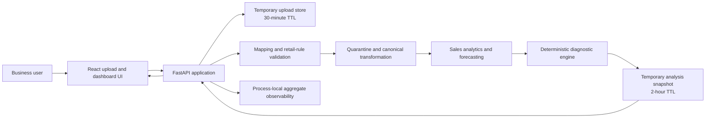
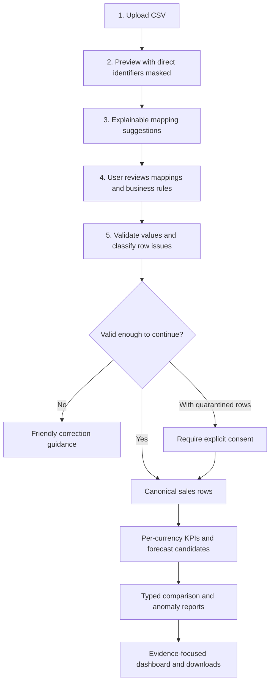

# Architecture Case Study: Evidence-Backed Sales Intelligence

## Executive summary

This portfolio MVP focuses on small online retailers selling repeat-purchase
physical products. It turns an unfamiliar sales CSV into an auditable
decision-support dashboard. Its central engineering challenge is not chart
generation; it is producing useful conclusions without silently guessing what
the business's columns, statuses, currencies, or accounting rules mean.

The implemented system therefore uses a deterministic analytics core. A user
reviews schema suggestions and business rules, invalid rows are quarantined,
and all financial calculations operate on a canonical sales model. Diagnostic
findings keep observations, numerical evidence, limitations, confidence, and
recommended investigations in separate typed fields.

The implemented RAG layer retrieves approved documents and can produce
experimental claim-level answers with verified quotes and citations. It cannot
calculate money, change diagnostics, explain forecasts, or take business actions.
Provider outages and failed verification return no generated claims.

## 1. Problem and intended user

### User

The first target user is an owner or operator of a small online retailer selling
physical products with repeat sales and no dedicated data team. They have order
exports and need to understand sales changes before planning any restock. The
generic CSV path remains usable for other businesses with valid data; no
business-type gate was added. Olist remains a benchmark and fixed demo.

### Questions the product answers

- What changed in the latest complete business period?
- Which measurable factors contributed mathematically to that change?
- Is the movement unusual relative to available history?
- How reliable is the conclusion, and what data limitations apply?
- What should a human investigate next?
- What do approved shipping, refund, or catalogue documents say about a policy?
- When the data supports it, what seven-day product-unit estimate is available
  as an exploratory preview?

The sales path requires order, date, customer, and an accepted revenue meaning.
Status values must be classified or all rows confirmed completed. Product-unit
previews additionally require product identity, quantity, units, safe history,
and confirmed open-day and stockout semantics. Missing or ambiguous evidence
reduces capability or withholds the result.

### Non-goals

- Certified accounting or financial reporting.
- Causal claims from observational sales data.
- Autonomous pricing, purchasing, marketing, or inventory decisions.
- Profit, inventory, or churn recommendations without their required data.
- Production multi-tenant software in the current local architecture.
- Decision-ready restocking advice or ingredient-level planning.

## 2. Requirements that shaped the architecture

### Functional requirements

- Accept multiple common CSV layouts without hard-coding one business file.
- Explain and require review of column mappings and retail recognition rules.
- Preserve rejected rows and reasons instead of silently repairing them.
- Keep currencies separate.
- Compare complete, consecutive periods and protect forecasting from missing
  periods or refund-only adjustments.
- Show evidence, confidence, limitations, and safe next investigations.
- Return friendly unavailable states when evidence is insufficient.

### Quality requirements

- **Deterministic:** identical canonical input and configuration produce the
  same calculation and diagnostic.
- **Traceable:** every financial statement comes from structured evidence.
- **Conservative:** missing or ambiguous data reduces capability or trust.
- **Testable:** business rules have positive, negative, and unavailable cases.
- **Private by default:** temporary local stores and aggregate observability do
  not retain source rows in metrics.
- **Extensible:** explanation technology can change without changing the
  financial calculation path.

## 3. Implemented architecture

The current system is a modular monolith: React provides the guided workflow,
FastAPI owns the API and temporary sessions, and Python domain modules perform
validation, transformation, analytics, forecasting, and diagnostics.



### Component responsibilities

| Boundary | Responsibility | Important constraint |
|---|---|---|
| React workflow | Upload, review mappings, confirm business rules, show evidence and fallbacks | Suggestions are not silently accepted |
| FastAPI | Request validation, orchestration, serialization, temporary resource lifecycle | Current bearer-like IDs are not customer authentication |
| Schema mapping | Suggest and validate canonical fields | Header matching is explainable and user-reviewed |
| Generic sales domain | Validate values, quarantine rows, transform into the canonical model | Ambiguous financial meaning is never guessed |
| Analytics | Calculate KPIs and charts per currency | Unlike currencies are never added |
| Forecasting | Compare eligible transparent methods through rolling backtests | Missing periods and limited history lower trust or disable output |
| Diagnostics | Compare periods, decompose recognized-sales change, detect robust anomalies, rank investigations | No causal claims or autonomous actions |
| Observability | Count outcomes and local latency | No CSV content, filenames, business IDs, or insight text |

## 4. Trusted data flow



The trust boundary begins before analysis. The system asks the business to
confirm whether revenue is a row total, `unit price × quantity`, or an order
total; how statuses should be classified; and how discounts, refunds, tax, and
shipping should be treated. Invalid or conflicting rows receive machine-readable
issue codes and human-readable reasons.

Financial calculations then use canonical fields rather than source headers.
This makes downstream analytics independent of one industry's export format
while preserving the business's confirmed meaning.

## 5. Diagnostic and forecast design

### Diagnostics

The diagnostic domain is independent of FastAPI and any future model provider.
Its immutable contracts separate:

- observation;
- comparison period;
- numerical evidence and provenance;
- mathematical contributors;
- confidence and limitations;
- recommended investigation and priority.

The period comparison uses recognized sales because it has an exact identity:

```text
recognized sales = completed order count × average order value
```

A symmetric decomposition assigns the exact sales change to order-count and
average-order-value contributions. This is mathematical attribution, not a
claim that either factor caused the business outcome.

Anomaly detection compares the latest complete month with the median and
Median Absolute Deviation of six prior complete, consecutive months. The
robust method is less distorted by spikes than a mean and standard deviation.
It returns `available`, `no_findings`, or `unavailable`; insufficient history is
a valid guarded result, not an application failure.

Recommendations use a transparent deterministic score:

```text
priority score = impact + urgency + confidence
```

Every recommendation is an investigation for human review. Nothing is
executed automatically.

### Forecasting

The forecaster does not rely on one universal method. It evaluates the methods
eligible for the available history, including recent value, moving averages,
linear trends, and annual seasonal-naive forecasting when enough data exists.
Rolling-origin backtesting selects the lowest historical MAE and reports MAE,
RMSE, WAPE, the comparison table, selection reason, and a conservative trust
label.

Forecast quality therefore depends on both software quality and evidence
quality. The system remains responsible for testing suitable candidates and
communicating uncertainty; it cannot manufacture seasonality from a short
history.

## 6. API and storage boundaries

The current workflow is exposed through versioned `/api/v1` endpoints for
upload preview, mapping suggestions, validation, transformation, analysis,
downloads, saved analysis retrieval, deletion, and local observability.

Uploads are held in process memory for 30 minutes and analysis snapshots for
two hours. This is appropriate for a local portfolio and controlled evaluation
stage because it minimizes persistence. It is not horizontally scalable,
durable, authenticated, or sufficient for multiple customer organizations.

Before public deployment, the architecture needs:

- authenticated users and organization-scoped authorization;
- encrypted durable storage with explicit retention and deletion rules;
- tenant-scoped object and document storage;
- protected, durable monitoring and audit logs;
- rate limits, operational alerts, backups, and recovery procedures; and
- a deployment-specific privacy and security review.

## 7. Evaluation evidence

The implemented evaluation strategy uses complementary layers rather than one
accuracy number:

| Evidence | Scope | What it does not prove |
|---|---|---|
| 10 synthetic industry anomaly scenarios | Alerts, no-findings, and safe unavailable states across varied patterns | Validation with ten real businesses |
| 15 end-to-end CSV trust scenarios | Mapping, financial rules, validation, quarantine, currencies, analytics, and forecasts | Coverage of every external export format |
| Domain and API regression suite | Contract invariants and safe fallbacks | Production reliability under customer traffic |
| Playwright Chromium journeys | Browser-to-API success, quarantine consent, limited-data fallback, product-demand preview, and document answers | Full browser and accessibility certification |
| Process-local scorecard | Analysis latency, availability, forecast states, and internal fallback counts | Durable production observability |
| Product-demand locked M5 holdout | 48 disjoint item-store series and 13 unseen weekly windows each; sparse stratum failed | Independent accuracy for small online retailers |
| RAG Phase 1 locked test | Source ranking, passage retrieval, abstention, and scope isolation passed | Generated-answer quality |
| RAG Phase 2 development tests | Verification, isolation, and provider failure handling | Locked Gemini answer quality; provider quota blocked the hard development run |

The [retailer evaluation matrix](evaluation/online_retailer_evidence_matrix.md)
maps common retailer scenarios to current tests and remaining evidence gaps.
These engineering signals do not replace anonymized real-business validation
and reviewer feedback.

## 8. Bounded RAG boundary

For an owned analysis, a guest may upload approved UTF-8 text or Markdown
documents. Phase 1 indexes the latest document version and retrieves cited
excerpts; the locked retrieval test passed its declared gates. Phase 2 sends
only the question and selected excerpts to a provider. Each returned claim
must name a retrieved chunk and copy an exact supporting quote. A deterministic
verifier rejects the entire answer when any claim fails verification. The
generated-answer feature is experimental because its locked answer evaluation
and manual failure review remain pending.

Sales CSV rows, canonical data, forecasts, and diagnostics never enter this
document-answer prompt. The current guest and analysis IDs scope document
operations, and a provider outage leaves analytics and evidence retrieval
available. This is temporary portfolio isolation, not customer authentication
or durable tenant storage. The accepted boundaries are recorded in
[ADR-014](architecture/ADR-014-rag-phase-1-retrieval.md) and
[ADR-015](architecture/ADR-015-experimental-grounded-document-answers.md).

An authenticated explanation of validated diagnostics would be a separate
future design and evaluation task; it is not an implemented RAG capability.

### RAG security and evaluation gates

The local portfolio demo has bounded, analysis-scoped document answers, but it
is not a production customer-facing release. That would additionally require:

- zero cross-tenant retrieval in an authorization test suite;
- zero financial-number mismatches in the release safety set;
- zero document-based claims without valid citations;
- safe abstention when no relevant document exists;
- resistance to prompt injection embedded in retrieved documents;
- filtering and retention controls for sensitive document content;
- citation relevance and retrieval quality on a representative approved corpus;
- human evaluation of usefulness, faithfulness, tone, latency, and cost; and
- a provider outage path that preserves the deterministic dashboard.

Authentication, tenant authorization, and durable document governance are
prerequisites—not optional clean-up after RAG is added.

## 9. Key trade-offs and revisit points

| Decision | Benefit now | Cost / revisit trigger |
|---|---|---|
| Modular monolith | Simple local development and atomic domain changes | Split only if measured scaling, ownership, or deployment needs diverge |
| Deterministic analytics | Auditable financial outputs and reproducible tests | Rules and models require deliberate maintenance |
| User-reviewed mapping | Prevents confident schema mistakes | Adds onboarding friction; improve suggestions using reviewed examples later |
| Process-local storage | Minimal retention and infrastructure | Replace before multi-instance or customer deployment |
| Transparent forecast candidates | Explainable selection and honest trust | Add models only when rolling evaluation proves useful across target businesses |
| Bounded RAG explanation | Adds business context without surrendering numerical control | Requires identity, document governance, retrieval evaluation, and model monitoring |

## 10. Next flagship phase

The first-release audience is a small online retailer selling repeat-purchase
physical products. The implemented product-demand target is a per-product
seven-day fulfilled-unit total, with a separately gated category fallback.
These are **planning previews**, not supported restocking quantities. The
[retailer evidence matrix](evaluation/online_retailer_evidence_matrix.md)
maps regular, sparse, new-product, return, missing-day, and stockout cases to
their existing tests and remaining evidence gaps.

The M5 locked holdout found a sparse-product failure. A subsequent sparse
abstention candidate failed fresh validation, and a three-block consistency
candidate failed development testing. Neither was adopted as a proven fix.
The next forecast checkpoint is a permissioned, anonymized retailer export
with independently checked business semantics. Evaluate the frozen policy
first; if it motivates a new safeguard, compare candidates on development
data and test the selected rule on a new untouched holdout. Keep the earlier
failed locked result visible.

RAG Phase 1 retrieval is implemented and evaluated. Phase 2 bounded document
answers are implemented but experimental: provider quota blocked the hard
development evaluation, and the untouched locked answer test remains pending.
Neither RAG phase reads sales rows or validates forecast accuracy. Later
production work still needs authenticated tenancy, durable storage, document
governance, protected monitoring, and deployment evidence.
